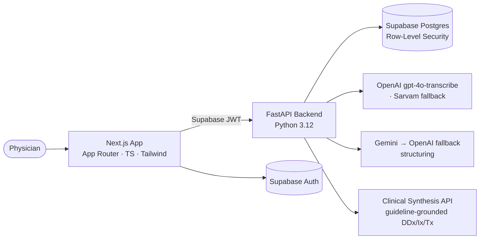

# Clinical Memory AI

**A clinical documentation and decision-support platform for physicians and small clinics.**

Turn a spoken consultation into a structured, medico-legally-shaped note — with longitudinal patient
memory and guideline-grounded decision support. The physician stays in control at every step.

[](https://github.com/zayedongit/clinical-memory-ai/actions/workflows/ci.yml)


> **Not an autonomous diagnosis or prescription system.** Every AI output is a draft the physician
> reviews, edits, and explicitly attests before it becomes part of the record.

> **Status:** working local prototype under active development. Not deployed, not a certified medical
> device. Reviewed weekly with a qualified physician.

📄 **[Read the case study](docs/CASE_STUDY.md)** — the engineering decisions, what broke, and what I'd
fix given another week.

---

## In plain terms

A doctor in a short consultation has to listen, examine, recall the patient's history, decide on tests,
and write a prescription — while also writing notes. Things get rushed, and history gets lost between
visits.

Clinical Memory AI listens to the consultation (with consent) and turns it into a clean, organised
note, so the doctor can look at the patient instead of the keyboard. It remembers every visit under
that patient, and offers a second opinion — possible causes, tests worth considering, suitable
medicines with real brands and prices.

It never decides anything on its own. It suggests; the doctor reviews, edits, and personally signs off.

---

## What it does

- **AI Scribe** — records the consultation (multilingual, including Hindi/English code-mixing),
  transcribes it, and auto-populates a structured encounter.
- **Consultation wizard** — Consultation → Prescription → Review & Sign, with draft/resume and
  physician attestation.
- **Longitudinal memory** — every visit stored per patient, with history-aware notes and cross-visit
  trends.
- **Clinical decision support** — ranked differential diagnosis with ICD-10 codes, investigations by
  urgency, and evidence-based treatment with local drug brands and prices. Physician-review-only.
- **Real formulary** — a 100k-item hospital catalogue with allergy and duplicate-therapy checks
  against the patient's own record.
- **Safety by design** — recording consent, enforced attestation, an append-only audit trail, and a
  printable prescription / visit record.

---

## Architecture



Multi-tenant by design: **every clinical table is clinic-scoped via Postgres Row-Level Security**,
enforced by passing the user's JWT through to PostgREST. If application code asks for the wrong
clinic's rows, the database returns nothing.

---

## Engineering highlights

- **Isolation enforced by the database, not the app.** RLS policies restrict every row to
  `clinic_id = current_clinic_id()`, with an isolation proof in `supabase/tests/rls_isolation_test.sql`.
- **Append-only provenance.** `clinical_facts` stores each fact with its type, source (AI-extracted vs
  doctor-confirmed) and status (proposed / confirmed / superseded). Nothing is edited in place.
- **Tamper-evident audit log.** A database trigger blocks `UPDATE`/`DELETE`, and each row carries a
  SHA-256 hash chained to the previous one. Append-only and tamper-*evident* — not tamper-proof.
- **Fabricated citations are dropped.** The model must quote the exact supporting words from the
  transcript, and the code verifies each quote actually appears in it.
- **Degrade, don't fail.** Runtime provider failover on structuring (Gemini → OpenAI), JSON salvage for
  malformed output, fail-open suggestions with an explicit "unavailable" banner — and fail-*closed*
  attestation, because the backend refuses to save a completed note without physician sign-off.
  (Speech-to-text picks Sarvam when the OpenAI key isn't configured; that's a config-time choice, not
  runtime failover.)
- **Measured clinical quality.** A red-flag evaluation harness scores decision support against
  can't-miss presentations for recall and no-false-alarm precision, runnable in CI without an LLM.
- **PHI-aware logging.** Structured JSON logs with per-request IDs that never log request bodies and
  redact sensitive fields.

---

## What broke

Two failures worth reading, because how they were found says more than the fixes.

**The Gemini key was returning 401, and the symptom looked like a model problem.** Extraction started
returning empty, which reads like a prompt failure. Rather than rewriting prompts, I wrote
`backend/scripts/diag_ai.py` to call each provider directly and print the raw response: Gemini returned
HTTP 401, OpenAI returned normally. The problem was authentication, one layer below the symptom. The
fix was the OpenAI fallback; the diagnostic script stayed in the repo.

**Our own rate limiter blocked our own live scribe.** The live flow calls `/scribe/transcribe`,
`/scribe/live` and `/scribe/extract` many times a minute by design, and the limiter treated it as
abuse. Nothing
errored — the note and suggestions just came back empty. Tracing one consultation request by request
found the limiter rejecting our own calls. I exempted the three live endpoints.

Both symptoms lied. Neither surfaced as an error. → [Full detail in the case study](docs/CASE_STUDY.md)

---

## What I'd fix given another week

1. **Transactional save** — visit, note, `clinical_facts` and audit are separate writes; a mid-way
   failure leaves a partial save. Move it into one Postgres function.
2. **Optimistic locking on finalize** — concurrent finalizes are last-write-wins today.
3. **Blocking backend tests in CI** — the backend test step runs `continue-on-error: true`.
4. **Redis-backed rate limiter** — the in-memory limiter counts per process, so N instances means N×
   the configured limit.
5. **Metrics and tracing** — logging exists, metrics and tracing don't.
6. **Deploy it** — the Cloudflare path is configured for the frontend but unverified; the backend is
   not containerized.
7. **Code the diagnoses** — differentials carry ICD-10, but saved diagnoses and prescriptions are
   largely free text.
8. **Validate the `q` search filter**, which is interpolated into a PostgREST filter string and needs
   proper escaping. First on the list.
9. **Cap AI/speech spend**, lock CORS to the real origin, add fine-grained roles, and move route
   protection server-side — it's a client-side session check today.

---

## Testing (honest state)

Coverage is minimal and I'd rather say so: one backend health test, one RLS isolation SQL test, and the
red-flag evaluation harness (`backend/eval/` + `backend/scripts/eval_red_flags.py` — an evaluation, not a unit
test). No frontend tests yet.

CI runs on every push via GitHub Actions: the frontend type-checks, lints and builds; the backend lints
with ruff and runs tests. The backend test step is `continue-on-error: true`, so a failing test doesn't
fail the build — that should be tightened once there's a real suite. The eval harness is runnable in CI
but isn't wired in as a gate yet. There is no CD.

---

## Tech stack

| Layer | Technology |
|---|---|
| Frontend | Next.js (App Router), TypeScript, Tailwind CSS |
| Backend | FastAPI, Python 3.12, `uv` |
| Database / Auth | Supabase (PostgreSQL + Row-Level Security), PostgREST |
| Speech-to-text | OpenAI `gpt-4o-transcribe` (Sarvam fallback) |
| LLM structuring | Google Gemini → OpenAI fallback |
| Decision support | External Clinical Synthesis API (guideline-grounded) — not built by me |
| Deploy | Local only — Cloudflare path configured for frontend, not verified |

---

## Getting started

```bash
# backend
cd backend
cp .env.example .env          # fill in your own keys
uv sync
uv run fastapi dev app/main.py

# frontend
cd frontend
cp .env.local.example .env.local
pnpm install
pnpm dev

# database
supabase db push
```

Configuration lives in `backend/.env` (git-ignored). See `backend/.env.example` for the full list.
Never commit real keys; the frontend uses only the public Supabase anon key.

---

## Project structure

```
clinical-memory-ai/
├── frontend/        # Next.js app (consultation wizard, patient records, dashboard)
├── backend/         # FastAPI (scribe, decision-support proxy, formulary, RLS-scoped CRUD)
│   ├── app/
│   ├── scripts/     # data ingestion + diag_ai.py provider diagnostics
│   └── eval/        # red-flag evaluation harness
├── supabase/        # SQL migrations (schema, RLS, functions) + rls_isolation_test.sql
└── docs/            # CASE_STUDY.md, screenshots
```

---

## Screenshots

| Structured consultation | AI Scribe → auto-filled encounter |
| --- | --- |
|  |  |
| **Differential diagnosis with ICD-10** | **Evidence-based treatment + brands** |
|  |  |

**Printable prescription / visit record**


---

## How this was built

Built solo, with heavy use of AI coding assistants — stated rather than left to be inferred. The
architectural decisions are mine and I can defend them: RLS over application-layer filtering,
append-only provenance, quote verification, fail-open suggestions with fail-closed attestation, the
two-lane live scribe. Generated code was reviewed and reworked rather than accepted — both failures
above are cases where the generated version looked fine and was wrong.

I can open any file here, explain what it does and why it's shaped that way, and change it live.

---

## License

Copyright Clinical Memory AI. All rights reserved. This source is public for viewing and reference
only; it is not licensed for reuse, redistribution, or commercial use without written permission.
