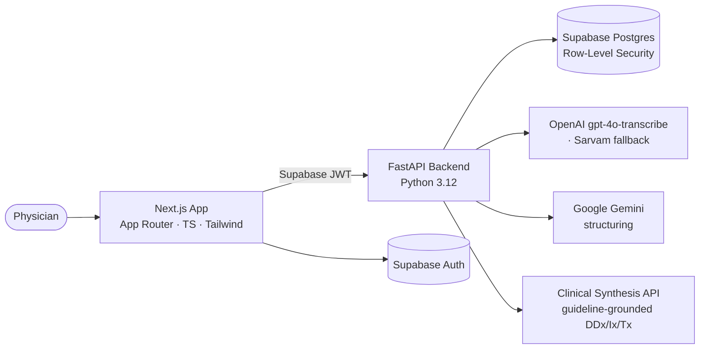
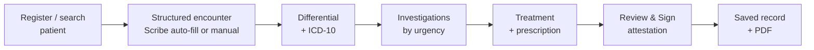
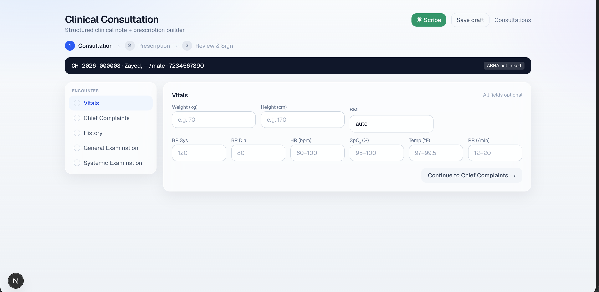
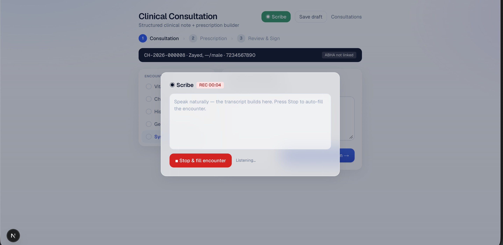
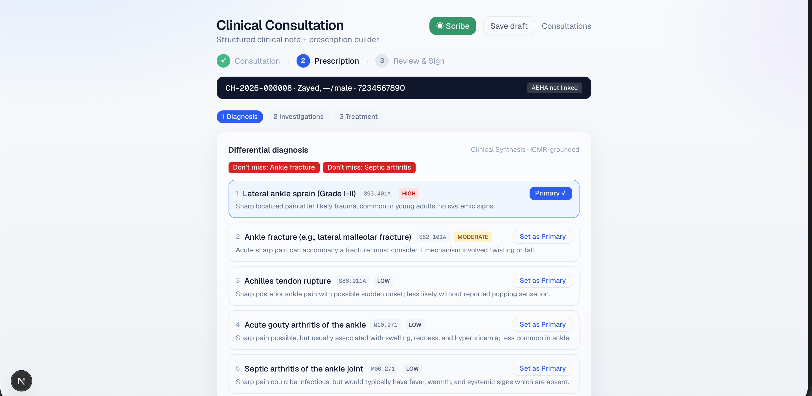
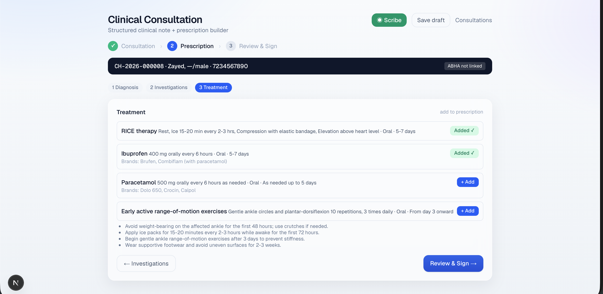
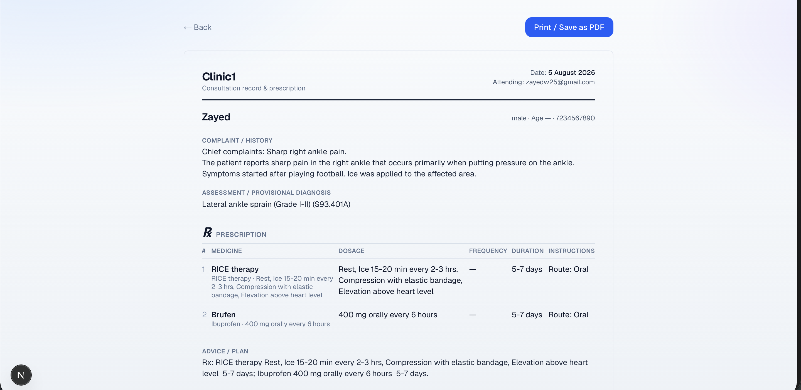

<div align="center">

# Clinical Memory AI

**A web-first clinical documentation and decision-support platform for physicians and small clinics.**

Turn a spoken consultation into a structured, medico-legally-shaped note — with longitudinal
patient memory and guideline-grounded clinical decision support. The physician stays in control
at every step.


</div>

> **Not an autonomous diagnosis or prescription system.** Every AI output is a draft the physician
> reviews, edits, and explicitly attests before it becomes part of the record.

---

## In plain terms

Think about a normal visit to the doctor. The doctor listens to you, asks questions, and while
doing all that, has to scribble notes, remember your past visits, decide what tests you might
need, and write a prescription — often in just a few minutes, for patient after patient. A lot
gets rushed, forgotten, or lost on scraps of paper.

**Clinical Memory AI is like a smart assistant that sits quietly beside the doctor during the
consultation.** It listens to the conversation (with the patient's permission), and turns it into
a clean, organized medical note automatically — so the doctor can actually look at the patient
instead of the keyboard.

It also acts as the clinic's memory. Every visit is saved under that patient, so next time the
doctor instantly sees the full story: past illnesses, medicines, allergies, and what's changed.

And it gently offers a second opinion — a list of possible causes for the symptoms, tests worth
considering, and suitable medicines (with real brand names and prices). But here's the important
part: **it never decides anything on its own.** It only suggests. The doctor reviews everything,
edits whatever they want, and personally signs off before it becomes official. The AI is the
helper; the doctor is always the boss.

## What it does

- **AI Scribe** — records the consultation (multilingual, including Hindi/English code-mixing),
  transcribes it, and **auto-populates a structured encounter** (chief complaints, history,
  vitals, examination).
- **Consultation wizard** — a clean 3-step flow (**Consultation → Prescription → Review & Sign**)
  with a persistent patient banner, draft/resume, and physician attestation.
- **Longitudinal memory** — every visit is stored per patient with history-aware notes and
  cross-visit trends.
- **Clinical decision support** — ranked **differential diagnosis with ICD-10 codes**,
  investigations (with urgency), and evidence-based treatment with local drug **brands and prices** —
  guideline-grounded and physician-review-only.
- **Real formulary** — search a **100k-item hospital catalogue** (brands, strengths, MRP,
  therapeutic class) with allergy and duplicate-therapy checks against the patient's own record.
- **Safety and trust by design** — recording consent, enforced physician attestation, an audit
  trail, and a printable prescription / visit record.

## Architecture



Multi-tenant by design: **every clinical table is clinic-scoped via Postgres Row-Level Security**,
enforced by passing the user's JWT through to PostgREST.

## The consultation flow



## Engineering highlights

- **Measured clinical quality, not vibes** — a red-flag **evaluation harness** scores the
  decision support against classic can't-miss presentations and reports recall plus a
  no-false-alarm (precision) metric, runnable in CI without an LLM.
- **Multi-tenant isolation** — Row-Level Security with an isolation proof in the schema tests.
- **Safety by design** — consent capture, server-enforced physician attestation, and an
  append-only audit log.
- **Resilient AI pipeline** — provider fallback for speech-to-text, model fallback and JSON
  repair for structuring, and fail-open decision support so a partial encounter never hard-fails.
- **Real-world data** — ingestion of a 100k-item hospital formulary and an ICMR-derived
  knowledge base for grounding.
- **CI** — lint, typecheck, and build on every push.

## Tech stack

| Layer | Technology |
|---|---|
| Frontend | Next.js (App Router), TypeScript, Tailwind CSS |
| Backend | FastAPI, Python 3.12, `uv` |
| Database / Auth / Storage | Supabase (PostgreSQL + Row-Level Security) |
| Speech-to-text | OpenAI `gpt-4o-transcribe` (Sarvam fallback) |
| LLM structuring | Google Gemini |
| Decision support | External Clinical Synthesis API (guideline-grounded) |
| Deploy | Cloudflare (OpenNext) · containerized backend |

## Screenshots

| Structured consultation | AI Scribe → auto-filled encounter |
|:--:|:--:|
|  |  |
| **Differential diagnosis with ICD-10** | **Evidence-based treatment + brands** |
|  |  |

**Printable prescription / visit record**



## Getting started

```bash
# backend
cd backend
cp .env.example .env          # fill in your own keys
uv sync
uv run fastapi dev app/main.py

# frontend
cd frontend
cp .env.local.example .env.local
pnpm install
pnpm dev

# database
supabase db push
```

Configuration lives in `backend/.env` (git-ignored). See `backend/.env.example` for the full
list. Never commit real keys; the frontend uses only the public Supabase anon key.

## Project structure

```
clinical-memory-ai/
├── frontend/        # Next.js app (consultation wizard, patient records, dashboard)
├── backend/         # FastAPI (scribe, decision-support proxy, formulary, RLS-scoped CRUD)
│   ├── app/
│   ├── scripts/     # data ingestion (formulary, knowledge base)
│   └── eval/        # red-flag evaluation harness
├── supabase/        # SQL migrations (schema, RLS, functions)
└── docs/
```

## Status and disclaimer

Active development — a working prototype, **not a certified medical device**. AI output is
decision *support* for a licensed physician, who remains the responsible clinician.

## License

Copyright Clinical Memory AI. All rights reserved. This source is public for viewing and
reference only; it is not licensed for reuse, redistribution, or commercial use without written
permission.
