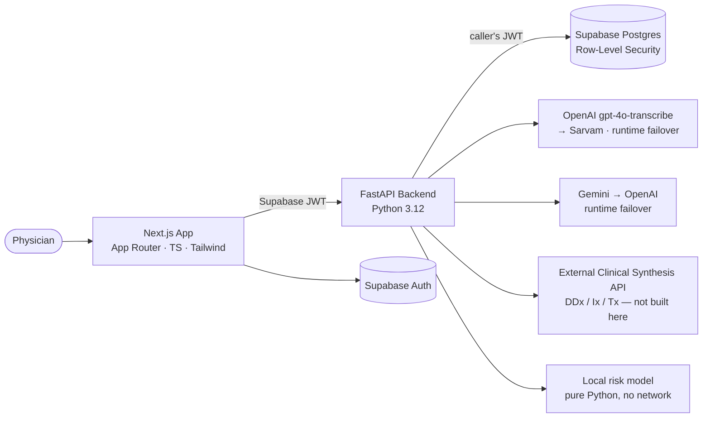

# Clinical Memory AI

**A clinical documentation and longitudinal-memory platform for physicians and small clinics.**

A consultation is spoken, not typed. This turns the spoken consultation into a
structured, medico-legally shaped note, carries the patient's history across
visits as measurable signal rather than as a list, and offers physician-review-only
decision support. The physician reviews, edits, and signs. Nothing enters the
record without that signature.

[](https://github.com/zayedongit/clinical-memory-ai/actions/workflows/ci.yml)


> **Not an autonomous diagnosis or prescription system.** Every AI output is a
> draft. The backend refuses to finalise a note without an explicit attestation
> from a user whose role may sign.

> **Status:** working local prototype. Not deployed, not a certified medical
> device, not clinically validated. Reviewed with a qualified physician.

**Read next:** [project guide](docs/CLINICAL_MEMORY_AI_PROJECT_GUIDE.md) ·
[model card](docs/MODEL_CARD.md) · [intended use](docs/INTENDED_USE.md) ·
[case study](docs/CASE_STUDY.md)

---

## In plain terms

A doctor in a ten-minute consultation has to listen, examine, remember what
happened last time, decide on tests, and write a prescription — while also
typing notes. Notes get rushed. History gets lost between visits. And there is
usually no record of *where* any given piece of information came from.

This system listens (with consent), writes the note, and remembers. It shows
the patient's story the moment a consultation opens, tells the doctor when a
vital sign is genuinely trending rather than just varying, and offers a second
opinion on what to consider.

It never decides anything. It suggests; the physician reviews, corrects, and
personally signs.

---

## What it does

| | |
|---|---|
| **AI scribe** | Records the consultation (Hindi–English code-mixed), transcribes it with runtime failover across two providers, and fills the structured encounter as the doctor talks |
| **Verified evidence** | Every auto-filled field carries the verbatim words that produced it — and the server checks each quote actually appears in the transcript before showing it |
| **Longitudinal analytics** | Mann–Kendall trend tests, Theil–Sen slopes and robust step detection across visits; recurring complaints; medication starts and stops; problems recorded as current and never revisited |
| **Escalation prompt** | A calibrated, interpretable model plus deterministic published criteria, answering only "is this worth a second look?" |
| **Decision support** | Ranked differential, investigations by urgency, treatment with real brands and prices — from an **external** service this project did not build |
| **Real formulary** | A 100k-item hospital catalogue, with allergy and duplicate-therapy checks against the patient's own record |
| **Safety by construction** | Recording consent, database-enforced attestation, an append-only tamper-evident audit trail, and signed notes that can be amended but never rewritten |

---

## Architecture



**Isolation lives in the database, not in application code.** Every clinical
table is clinic-scoped by Row-Level Security, and the backend forwards the
caller's own JWT to PostgREST so the database evaluates every policy against
their identity. No query in this codebase filters by `clinic_id` — deliberately.
If application code asks for another clinic's rows, it gets nothing.

**The rules that matter are enforced in Postgres.** Signing a consultation is
one function, `finalize_visit()`, running in one transaction. It requires
attestation, requires the `doctor` role, refuses to re-sign an already-signed
visit, and rejects a write whose expected version is stale. Those guarantees
hold even if the API is wrong or bypassed entirely.

---

## Engineering highlights

**Tenant isolation, proven.** 31 database tests run the real migrations against
a real PostgreSQL and then *try to cross the boundary* — read another clinic's
patient by id, insert into another clinic, walk a row out of its tenant with an
UPDATE. A structural test also fails if any new public table ships without RLS.

**One transaction, not five calls.** Signing used to be five independent
PostgREST calls; a failure part-way left an approved visit with a stale note, or
confirmed facts with no audit entry. It is now a single database function, and
a test asserts that an invalid fact rolls the whole thing back.

**Optimistic locking.** Two clinicians finalising the same consultation was
last-write-wins with no signal to either of them. `visits.version` plus
`SELECT … FOR UPDATE` now serialises them; the second gets a 409 and a message
that says to reload. Tested with two real connections racing.

**Signed notes are immutable; corrections append.** A trigger blocks every
clinical column on an attested note. Corrections go through `amend_visit_note()`
with an author, a timestamp and a mandatory reason. The text the physician
signed stays exactly as they signed it.

**Fabricated citations are dropped, and the drop rate is measured.** The model
must quote the transcript verbatim; the server verifies each quote and discards
what it cannot find. A tidied real quote survives; a swapped clinical noun does
not. Measured at **precision 1.00, recall 1.00** on a labelled synthetic set —
and precision is gated at 1.00 in CI, because showing a fabricated quote as
verified evidence converts a physician's scepticism into misplaced trust.

**Runtime failover that actually exists.** The previous README claimed
provider failover the code did not have: the LLM lane was Gemini-only, and
speech-to-text chose a provider at *configuration* time and returned 502 when it
failed — losing the doctor's speech with a healthy second provider sitting
configured. Both are now ordered chains that fail over at runtime, across
vendors, with the fallback rate exported as a metric. Sixteen tests cover the
matrix: transient errors, bad keys, connection failures, unparseable output.

**Degrade, don't fail — and say so.** Losing decision support cannot block
signing a note. Losing the risk model degrades to the deterministic safety
criteria. Losing every AI provider still leaves a working documentation system.
Each of those is a test.

**PHI-aware by default.** Request and response bodies are never logged.
Patient search terms are redacted — a log full of `q=Sharma` is a log full of
patient names. Metric labels are low-cardinality by construction, and route
labels collapse ids so no patient gets their own metric series. The audit log
records *which fields* changed, not their values.

---

## AI, ML and analytics

Three capabilities, each with published numbers you can reproduce with
`make eval`.

### 1. Escalation-risk prompt — interpretable and calibrated

An L2 logistic regression over 46 **named** clinical features (vital-sign
cut-points, a symptom lexicon including Hinglish forms, comorbidity flags,
duration), calibrated with isotonic regression, exported to JSON, and served in
pure Python with no ML dependency in the API.

| Metric | Value |
|---|---|
| ROC-AUC | 0.902 |
| PR-AUC (baseline = 0.201) | 0.795 |
| Precision @ threshold 0.11 | 0.664 |
| Recall / sensitivity | 0.821 |
| Specificity | 0.896 |
| Expected calibration error | 0.100 → **0.010** after calibration |

End-to-end, with the deterministic criteria: **12/12 sensitivity** on red-flag
presentations, **1/12 false alarms** on benign controls that include deliberate
near-misses.

Every prediction explains itself, because in a linear model the contribution of
a feature *is* coefficient × value. The learned weights order as a clinician
would expect — focal neurological deficit +4.63, bleeding +4.00, altered mental
state +3.34 — which is a check you can only run on features you can name.

**The training data is synthetic and the model is not clinically validated.**
That is stated in the API response, printed in the UI next to the score, and
[explained in full in the model card](docs/MODEL_CARD.md).

### 2. Longitudinal analytics — statistics, not lists

Clinic visit series are short (3–12 points), irregularly spaced, and contain
transcription errors. That rules out anything assuming normality or even
spacing, so:

* **Mann–Kendall** for whether a monotonic trend exists — sign-based, so one
  mistyped reading cannot manufacture a trend.
* **Theil–Sen** for the slope — median of pairwise slopes, ~29% breakdown point,
  versus least squares which a single outlier rotates.
* **Median absolute deviation** for step detection, catching the flat-then-jump
  pattern that has no monotonic trend and is often the most interesting one.

On the seeded demo data these behave exactly as intended: a steadily rising BP
is reported as *rising, p=0.03, +2.1/30d*; a flat series with one jump is
reported as *no trend* **and** *step change detected*; six noisy readings around
a stable mean are reported as stable.

Plus recurring complaints counted per visit, medication starts and stops derived
from prescriptions rather than reported history, and problems recorded as
current and not revisited for 90+ days.

### 3. AI quality evaluation — a regression test, not a benchmark

`make eval-extraction` scores the extraction pipeline against a labelled
synthetic set. It runs deterministically with no API key, because the model
responses are frozen — which means the number moves when *our* code changes, not
when a provider ships a new checkpoint overnight.

| | Precision | Recall | F1 |
|---|---|---|---|
| **Citation verification** | 1.000 | 1.000 | 1.000 |
| Symptom extraction | 0.929 | 0.929 | 0.929 |
| Medication extraction | 1.000 | 1.000 | 1.000 |
| Allergy status (3-way) | — | — | 100% accuracy |

Citation verification is the strongest number here because its ground truth is
objective rather than judged: a quote either appears in the transcript or it
does not. `--live` runs the same cases through the real providers when the
question is about the model instead.

**This evaluation found real bugs.** A model answering `"None"` for allergies
was being parsed as an allergen literally called "None", which would have
printed in red on the patient's chart as an allergy.

### Documentation completeness — deterministic, replacing a guess

The note quality score used to be produced by asking the language model for a
`completeness_pct`. That number was unstable across runs on the same note,
unauditable, and cost tokens. It is now a 10-item weighted rubric that explains
itself item by item, is unit-tested, and costs nothing. "No known drug
allergies" counts as a complete allergy history, because a score that only
credits positive findings teaches clinicians to write noise.

It is a **documentation** metric. A note can score 100 and be clinically wrong.

---

## Testing

| Suite | Count | What it covers |
|---|---|---|
| Backend unit + integration | 277 | Auth, authorisation, provider failover, citation verification, JSON repair, rate limiting, spend control, metrics, PHI redaction, error translation |
| Database (real PostgreSQL) | 89 | RLS isolation, attestation, optimistic locking, audit hash chain, append-only facts, signed-note immutability, concurrent finalize |
| Frontend | 36 | Attestation gate, save-failure handling, draft resume with versioning, escalation panel, prescription safety, API error translation |
| **Total** | **402** | |

The database tests build a fresh database from the committed migrations every
run — which is itself the test that the migrations reproduce the system.

CI runs all of it on every push, plus both evaluation harnesses with their
gates, plus a retrain that fails if the committed model does not reproduce
exactly. **No step is `continue-on-error`.** A separate job fails the build on a
tracked `.env`, a credential-shaped string, or an evaluation dataset that does
not declare itself synthetic.

---

## Setup

```bash
make setup          # backend (uv) + frontend (pnpm), creates .env from templates

# database — either a linked Supabase project…
make db-push

# …or a local PostgreSQL built from the same migrations
make db-local
make demo-data      # synthetic patients whose histories exercise the analytics

make dev-backend    # :8000
make dev-frontend   # :3000
```

Configuration lives in `backend/.env` and `frontend/.env.local`, both
git-ignored. `backend/.env.example` documents every setting — a test fails if it
ever falls out of sync with the code.

Building requires no credentials: the Supabase client is constructed lazily, so
`pnpm run build` works on a fresh clone. The backend refuses to *start* without
its Supabase keys, which is the correct place to fail.

```bash
make check          # exactly what CI runs
make eval           # both evaluation harnesses
make train          # retrain the risk model and regenerate its metrics
```

---

## What is built here and what is not

Being precise about this matters more than it flatters.

| | |
|---|---|
| **Built here** | The consultation workflow, the data model and its provenance rules, RLS policies, the transactional finalize function, the audit hash chain, the provider-failover layer, citation verification, the escalation-risk model and its features, the longitudinal statistics, the completeness rubric, every evaluation harness, the metrics layer, all 402 tests |
| **Not built here** | Differential diagnosis, investigation and treatment recommendations — these come from an external Clinical Synthesis API. This project integrates it: request shaping, response normalisation, failure containment, and keeping its secret base URL out of the browser |
| **Third-party** | OpenAI and Sarvam for speech, Gemini and OpenAI for structuring, Supabase for Postgres and auth |

---

## Limitations

Stated plainly, because a portfolio project that hides these is not
demonstrating engineering judgement.

1. **The risk model is trained on synthetic data and is not clinically
   validated.** It has no established real-world performance.
2. **Not deployed.** It runs locally. The Cloudflare path is configured for the
   frontend and unverified; the backend is not containerised.
3. **Rate limiting and the spend cap are per-process.** Two workers means two
   independent windows. Correct across instances needs Redis.
4. **No fairness evaluation.** The synthetic cohort has no demographic
   attributes to measure subgroup performance across.
5. **Speech-to-text errs on drug names and doses**, especially in noise. The
   transcript is shown alongside the note so the physician can check the source.
6. **Drug safety checking is two narrow checks** — allergy and duplicate
   ingredient. Not interactions, not renal or hepatic dosing, not dose ceilings.
7. **Diagnoses and prescriptions are largely free text.** Differentials carry
   ICD-10 from the external service; what gets saved does not.
8. **No compliance certification.** The design aligns with DPDP Act 2023
   principles ([intended use](docs/INTENDED_USE.md)), but nothing here is
   HIPAA-, GDPR- or DPDP-certified, and no audit has been performed.
9. **Tamper-*evident*, not tamper-proof.** A database owner can rewrite history;
   the hash chain makes it detectable. `verify_audit_chain()` is the query, and
   a test proves it catches a rewrite.

---

## Tech stack

| Layer | Technology |
|---|---|
| Frontend | Next.js 16 (App Router), TypeScript, Tailwind, Vitest + Testing Library |
| Backend | FastAPI, Python 3.12, `uv`, pytest + respx |
| Database / Auth | Supabase (PostgreSQL 16 + Row-Level Security), PostgREST |
| Speech-to-text | OpenAI `gpt-4o-transcribe` → Sarvam (runtime failover) |
| LLM structuring | Gemini → OpenAI (runtime failover, cross-vendor) |
| ML | scikit-learn for training only; pure-Python JSON artefact at serve time |
| Decision support | External Clinical Synthesis API — not built here |
| Observability | Structured JSON logs, correlation ids, Prometheus-format metrics |

---

## Project structure

```
clinical-memory-ai/
├── frontend/            Next.js app + Vitest suite
│   ├── app/             consultation wizard, patient records, dashboard
│   ├── lib/             API client, prescription safety checks
│   └── tests/
├── backend/
│   ├── app/
│   │   ├── ai/          provider chain, STT chain, prompts, JSON repair, citations
│   │   ├── clinical/    completeness rubric, longitudinal statistics, risk wrapper
│   │   ├── ml/          feature engineering, synthetic cohort, model artefact + inference
│   │   ├── core/        config, Supabase access, metrics, rate limiting, budget
│   │   └── api/         routers
│   ├── eval/            datasets (synthetic) + committed results
│   ├── scripts/         training, evaluation, ingestion, demo seed
│   └── tests/           unit, integration, and tests/db against real PostgreSQL
├── supabase/
│   ├── migrations/      schema, RLS, triggers, finalize_visit()
│   └── tests/           auth shim for a local PostgreSQL
└── docs/                project guide, model card, intended use, case study
```

---

## Screenshots

| Structured consultation | AI Scribe → auto-filled encounter |
| --- | --- |
|  |  |
| **Differential diagnosis with ICD-10** | **Evidence-based treatment + brands** |
|  |  |

**Printable prescription / visit record**


---

## License

Copyright Clinical Memory AI. All rights reserved. This source is public for
viewing and reference only; it is not licensed for reuse, redistribution, or
commercial use without written permission.
